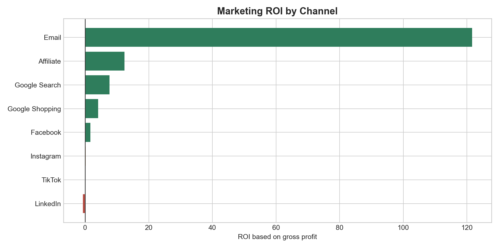

# Marketing Campaign Performance & ROI Analysis

This project analyzes campaign performance across paid and owned marketing channels, then recommends where to scale, reduce, or stop spend. It is designed as a business analytics portfolio project for marketing analyst, data analyst, and growth analyst roles.

## Business Problem

Marketing teams need to know which campaigns are actually profitable, not only which campaigns generate clicks or revenue. This project calculates CAC, ROAS, gross-profit ROI, and net profit after marketing, then converts those metrics into budget recommendations.

## Dashboard Preview



## Tools Used

- Python for data generation, analysis, and reporting
- Pandas for campaign and channel-level summaries
- Streamlit for interactive dashboard delivery
- HTML and Markdown reports for executive review
- CAC, ROAS, ROI, and budget reallocation analysis

## Key Results

- Revenue generated: $17,628,420
- Marketing spend: $1,576,894
- Blended CAC: $13
- Total marketing ROI based on gross profit: 543.6%
- Strongest channel: Email with 12,163.7% ROI and $2 CAC
- Weakest channel: LinkedIn with -68.5% ROI and $212 CAC
- Estimated profit impact from budget reallocation: $1,896,543

## Business Recommendations

1. Increase budget for high-intent search, affiliate, retargeting, and email campaigns.
2. Stop or sharply reduce negative-ROI campaigns before further spend.
3. Keep a small testing budget for awareness channels, but judge them separately from bottom-funnel campaigns.
4. Move reporting from vanity metrics to CAC, ROAS, gross-profit ROI, and net profit after marketing.
5. Review budget allocation weekly so spend follows performance.

## Project Outputs

- `marketing_roi_report.md`
- `marketing_roi_report.html`
- `campaign_performance_summary.csv`
- `channel_performance_summary.csv`
- `budget_reallocation_plan.csv`
- `roi_by_channel.png`
- `spend_vs_revenue_by_channel.png`
- `cac_by_campaign.png`
- `budget_reallocation.png`

## How To Run

```bash
pip install -r requirements.txt
python marketing_campaign_roi_analysis.py
streamlit run app.py
```

